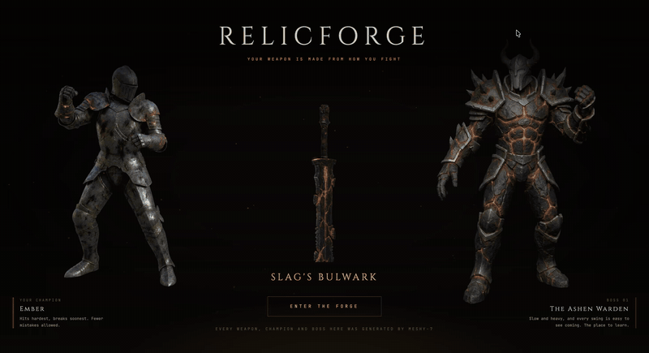

# RelicForge

> **Your weapon is made from how you fight**



*Every weapon, champion and boss above was generated. Nothing here was modelled by hand.*

**What if the reward for a fight was made out of the fight?**

Every weapon you have ever been handed in a game was finished months before you
played. An artist modelled a few hundred of them, they went in a folder, and when
you win the game reaches into that folder and gives you one. Beat the same boss as
someone else and you both walk away holding the identical object, no matter how
differently you got there.

RelicForge doesn't reach into a folder. It **makes the weapon after the fight**,
from how the fight went.

```
boss dies → read how you won → concept art → 3D model → in your hands
```

Two players beat the same boss and walk away holding physically different weapons, because they fought differently.

| You fought | You receive |
|---|---|
| Fire · heavy swings · 8% health · never healed | a thick, cracked, molten greatsword |
| Ice · precise strikes · 82% health · seven dodges | a slender, translucent, crystalline spear |

**Same boss. Different story. Different relic.**

Relics are pre-generated for **every boss and every playstyle**, so replaying any
of them resolves in ~33ms and spends nothing. Fight some other way and it
generates for real, which is the honest path and stays the honest path: a demo
just should not be one network round-trip away from an awkward silence.

---

## The interesting problem

Calling an API is not the hard part. The hard part is this:

> **Generated geometry is unpredictable, and a game needs it to be reliable.**

Meshy returns a beautiful weapon. Nothing promises it is upright, correctly scaled, or that your game knows where the handle is. A gorgeous sword held by the blade, floating sideways through the player's face, is not loot, it's a bug.

So RelicForge's first engineering task wasn't the boss fight or the API client. It was a blocking gate: **can arbitrary generated weapons be oriented, scaled, and gripped automatically, with zero manual asset editing?**

### What the measurement showed

Before writing any geometry math, the spike measured what orientation meshy-7's
output actually arrives in. Twelve shapes, chosen to be awkward on purpose:

| | raw angle off canonical |
|---|---|
| best 8 of 12 | **0.0° to 1.2°** |
| asymmetric axe | 10.8° |
| dagger | **25.8°** |
| ornate longsword | **50.3°** |

*Full twelve-shape results, with grip and end-confidence scores: [PRD.md §2](PRD.md#2-normalization).*

**Median raw angle: 0.9°.** Most shapes arrive essentially canonical, because
every concept is generated under a fixed composition contract, *vertical, tip
up, pommel down, three-quarter view*, and image-to-3d preserves that framing.

But look at the last two rows. On those, the PCA is not confirming a lucky
result, it is the only reason they end up upright at all.

That distinction matters, and an earlier version of this README got it wrong.
Measured on three shapes, the median was 0.1° and the conclusion looked like
"the hard version of this problem does not exist". Measured on twelve, two of
eight core shapes need real correction. Trusting the framing would have shipped
a game where roughly a quarter of weapons are visibly crooked in the player's
hand.

### The line that matters

An automatic pipeline with a structured human override is a real production system. One that needs a person to open Blender every time an AI generates a sword is not, the runtime-generation story would be fiction.

So RelicForge allows a persisted orientation hint, authored in seconds via `/lab` and stored on the relic record, and does **not** allow hand-editing a GLB. No shipped relic currently uses one.

*Pipeline internals, the hint's shape, and why area-weighted PCA beats the alternatives: [PRD.md §2](PRD.md#2-normalization).*

---

## Three things that cost credits to learn

None of these are bugs. Each is a place where the obvious first attempt was mine
to get wrong, and each changed the code.

**1. `target_polycount` needs `should_remesh: true` to do anything.**
It defaults to `false` on meshy-6/7, so my first requests looked complete and set
a polycount that never applied, returning meshes of **1.5M-3.1M triangles, 37-116
MB**. Sending both brings the same weapon back at ~12,000 triangles. Obvious once
you know; worth writing down for anyone budgeting mesh size on a first pass.

**2. My concept prompt was asking for the boss name, so it got one.**
The first Gate 1 concept rendered `ASHEN WARDEN` in large lettering across the
image, which then becomes real geometry and real texture in the 3D model. Faithful
execution of what I actually wrote. The composition contract gained explicit
no-text clauses, and `PROMPT_VERSION` was bumped, which invalidated every cached
relic automatically.

**3. Textures dominate once geometry is fixed.**
Three 4K PBR maps re-exported as PNG land at 12-22 MB. Generated GLBs pass through a gltf-transform stage (weld → dedup → prune → WebP @ 2K):

```
116 MB  →  1.55 MB     in ~500 ms
```

---

## How it works

```
                    ┌──────────────────────────────┐
   fight            │  React + React Three Fiber   │
   ─────────────▶   │  arena · boss · telemetry    │
                    └───────────────┬──────────────┘
                        CombatTelemetry (POST /api/relics)
                                    ▼
                    ┌──────────────────────────────┐
                    │   Fastify  (owns the key)    │
                    │                              │
   telemetry ──▶ buildRelicDNA ──▶ compileRelicPrompt
                    │                    │         │
                    │              relicCacheKey   │
                    │                    │         │
                    │        ┌───────────┴──────┐  │
                    │      HIT: 33ms, 0 credits │  │
                    │      MISS ▼               │  │
                    │   Meshy text-to-image     │  │
                    │        │ input_task_id    │  │
                    │        ▼                  │  │
                    │   Meshy image-to-3d       │  │
                    │   (meshy-7 + ultra)       │  │
                    │        ▼                  │  │
                    │   optimize · cache · store│  │
                    └───────────────┬──────────────┘
                          SSE domain events
                                    ▼
                    ┌──────────────────────────────┐
                    │  forge sequence · normalize  │
                    │  · attach to hand · wield    │
                    └──────────────────────────────┘
```

**Meshy endpoints used:** text-to-image, image-to-3d (meshy-7 + ultra), remesh,
rigging, animations, retexture, image-to-image, and balance. Eight, across
generation, topology, animation and metering.

**Two API details worth stealing:**

- **`input_task_id`**, image-to-3d accepts the id of a completed text-to-image task directly. The concept image never needs public hosting, which deletes an entire storage dependency from the pipeline.
- **Native per-task SSE**, `/v1/{text-to-image,image-to-3d}/:id/stream`. Consumed server-side and re-emitted as domain events, so there's no webhook receiver and no public tunnel for local development.

### Measured numbers

| stage | time |
|---|---|
| concept (nano-banana-pro) | 17-20 s |
| mesh (meshy-7 + ultra) | 86-115 s |
| optimize | ~500 ms |
| **total, live** | **~100-135 s** |
| **total, cached** | **33 ms** |

The forge sequence is built to hold that latency: named stages (`TEMPERING… SHAPING… BINDING… AWAKENING…`) driven by real task progress, and the concept image revealed early as a payoff in its own right. `Loading 47%` makes waiting feel like a defect. Naming the work makes it feel like a forge.

---

## Telemetry → DNA

Deterministic, so the causal link is legible to the player. Randomness here would turn the mechanic into a slot machine wearing a story.

| signal | rule | result |
|---|---|---|
| health remaining | ≤ 20% | `shattered` · achievement `DEATH'S DOOR` |
| | 21-70% | `battle-worn` |
| | ≥ 71% | `pristine` |
| heavy-attack ratio | ≥ 0.6 | `brutal` → greatsword |
| dodges ≥ 4, ratio ≤ 0.35 | | `elegant` → spear |
| affinity | fire / ice / storm | `fire` / `ice` / `lightning` |

The cache key hashes DNA **and the entire generation config**, prompt version, image model, ultra mode, polycount, PBR. Keying on DNA alone is the classic trap: you edit the prompt compiler, regenerate, receive the previously cached sword, and lose an afternoon to it.

---

## What a run looks like

Pick an affinity, it themes the entire arena, so an ember run and a frost run
do not read as the same footage twice. Then pick your quarry from the boss
ladder. There is deliberately **no difficulty slider**: both would scale the
same numbers, but only the ladder changes `bossInfluence`, which flows into the
concept prompt. Level 2 does not just hit harder, it forges a weapon grown from
salt and drowned bone instead of ash and molten rock.

You arrive holding a plain iron arming sword, mass-produced, one of eleven
million, and exactly the thing the relic exists to replace. Hold **TAB** for the
loadout and the second slot reads `??????`, because that weapon does not exist
yet and cannot be looked up. It will be generated from the fight you are
currently having.

Bosses and champions are Meshy-generated too, but **ahead of time**, by scripts
in `apps/api/scripts/`, and they ship as assets. Only the weapon is generated
while you play. The distinction matters: the runtime claim belongs to the relic
alone, and everything else is Meshy used the ordinary way, as a content tool.

They are also **rigged**, which is where the 5-credit rigging endpoint earns its
place: it ships walking and running clips free, and that is the difference
between a boss sliding across the floor and one that walks at you. Meshy
recommends t-pose input and these were generated in a-pose, so one character was
rigged first as a 5-credit test rather than regenerating the whole cast in t-pose
for roughly 350. It worked on the first attempt.

Every character also has a generated **attack** clip, and those are scrubbed
rather than played: the clip's time is written from the same progress the hit test
reads, so the blade cannot drift out of step with the damage whatever duration the
clip happens to have. The player's is stretched across wind-up plus active plus
recovery, so a faster relic plays the whole swing faster instead of playing part of
it. The body comes from the clip and the weapon keeps its own tuned arc, because
that arc was sized to read from ten metres and generated arm motion is
naturalistic and small.

Rigged output needs a different optimizer from static meshes, and assets are
loaded through three levels of degradation so a fight never depends on one being
present. *Both covered in [PRD.md §10](PRD.md#10-generated-content).*

## How you play

Most players assume loot comes from a table, so nothing about a boss fight signals that *how* you fight is the input. RelicForge says it once before the fight, then proves it during:

- A **briefing** states the premise and lists the controls (WASD to move, mouse to look, left mouse for a light attack, right mouse for a heavy one, Shift to dodge, Space to jump, Q to heal, V to switch between third and first person). It also gives pointer lock something to attach to, so the first click is explained rather than mysterious. The same list lives in the loadout, on Tab, which pauses the fight so looking something up costs nothing.
- A **live relic panel** in the corner runs the real `buildRelicDNA` against your telemetry as you fight. Commit to heavy attacks and `BALANCED` becomes `BRUTAL` in front of you. Drop below 20% health and `battle-worn` becomes `shattered`.

That panel is the tutorial. Watching the projection change is more convincing than any amount of explanation, and it means the reveal at the end confirms something the player already worked out.

A fight opens on **four seconds of camera** rather than on the pose you will play
from: the boss alone, then both fighters broadside with the arena between them,
then an arc that settles behind your champion, and a 3-2-1. The broadside shot is
the one that earns its place, because it is the only frame in the game containing
both fighters and the size difference is the argument for the fight. The last
keyframe is derived from the player camera's own boom maths rather than typed
again, so the handover has no cut in it, and the clock starts when combat arms, so
watching cannot inflate the fight duration the relic reads.

You then fight in **third person by default**, because choosing a champion and
then never seeing it makes the choice pointless. The champion is a rigged,
generated model swinging the real generated weapon. **V** switches to first
person, where armoured gauntlets hold the blade in view, since a floating camera
with no arms is not embodiment either.

Impact arrives on four channels at once, because any one alone reads as weak: a
floating damage number, a boss that staggers and is knocked back, camera shake,
and hitstop that freezes the shake decay for a few frames so a heavy hit lands
with weight.

## Setup

```bash
pnpm install
cp .env.example .env      # add your MESHY_API_KEY
pnpm dev                  # web :5173 · api :8787
```

| command | what it does |
|---|---|
| `pnpm dev` | web + api together, `/api` and `/assets` proxied |
| `pnpm test` | relic-core suite (205 tests) |
| `pnpm typecheck` | strict, all workspaces |
| `pnpm lint` | ESLint flat config, all workspaces |

Add `?mode=dev` to the game URL to use the cheap generation config (one concept, no ultra) while iterating.

**Routes:** `/` the game · `#/lab` the normalization harness · `#/compare` the two hero relics side by side, with a silhouette-only toggle · `/api/debug/relics` prompts, task ids, timings, cache hits.

Sound is synthesized at runtime with the Web Audio API, oscillators and filtered noise rather than sample files, so the repo carries no binary audio assets and no licensing questions.

---

## Layout

```
apps/web/src              React + R3F. Never sees Meshy.
  game/                   arena, boss, player, combat, telemetry capture
  forge/                  the reveal sequence
  state/                  Zustand stores
  debug/  lib/  ui/  audio/

apps/api/src              Fastify. Owns MESHY_API_KEY.
  routes/relics.ts        the whole public API surface
  services/meshy/         only place api.meshy.ai appears
  generation/             orchestration: concept → mesh → optimize
  cache/                  keyed file cache

packages/relic-core/src   Pure, no I/O. Imported by both.
  normalize.ts            orient, scale and grip arbitrary geometry
  dna.ts                  telemetry → Relic DNA
  prompt.ts               DNA → concept prompt, versioned
  cacheKey.ts             hash of DNA + full generation config
  attach.ts  traits.ts  naming.ts  stateMachine.ts
```

**If you only read three files:** [`normalize.ts`](packages/relic-core/src/normalize.ts) is the problem this project exists to solve, [`dna.ts`](packages/relic-core/src/dna.ts) is the mechanic, and [`services/meshy/`](apps/api/src/services/meshy) is every line that talks to the API.

`relic-core` staying pure is what lets the normalizer be unit-tested in Node against synthetic geometry **and** run in the browser at equip time. One implementation, one test suite, two runtimes.

In production Fastify serves the built client itself, so it runs as one process on one origin with no separate static host and no CORS surface. Set `CLIENT_ORIGIN` if you split them.

---

## Limitations, honestly

- **Two weapon classes ship** (greatsword, spear). Warhammer is implemented and in the normalizer's test corpus, but its end-resolution confidence sits at 0.09, so it stays behind a flag until that improves.
- **Articulated weapons are out of scope.** A chained flail has multiple rigid bodies and no single principal axis; it needs different runtime semantics, not a better heuristic.
- **Staggers and deaths are still whole-body transforms.** Walk, idle and attack are generated clips, but a boss that gets hit is moved rather than animated, and a boss that dies falls by transform.
- **The champion is cosmetic.** It swings the real generated weapon, but the choice is visual: champions do not change reach, damage or any other number the fight runs on.

## Where this goes

Once a game can generate assets from its own state, the same architecture covers one-of-one raid drops, tournament trophies, seasonal artifacts, guild monuments, and equipment that visibly evolves with the player who carries it.

The broader point: generative 3D can turn game state into **content**, not just help studios produce assets before launch.

